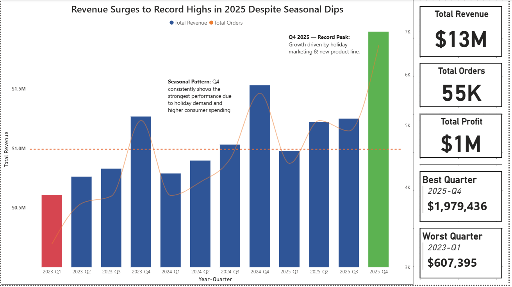
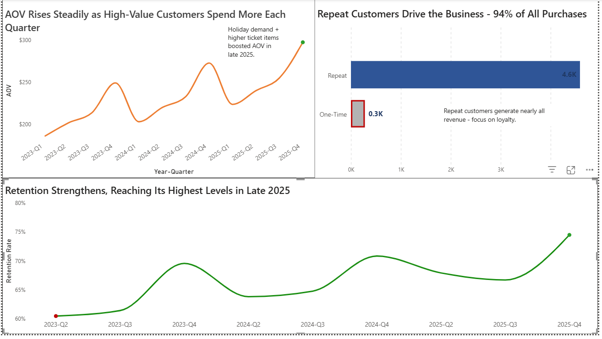
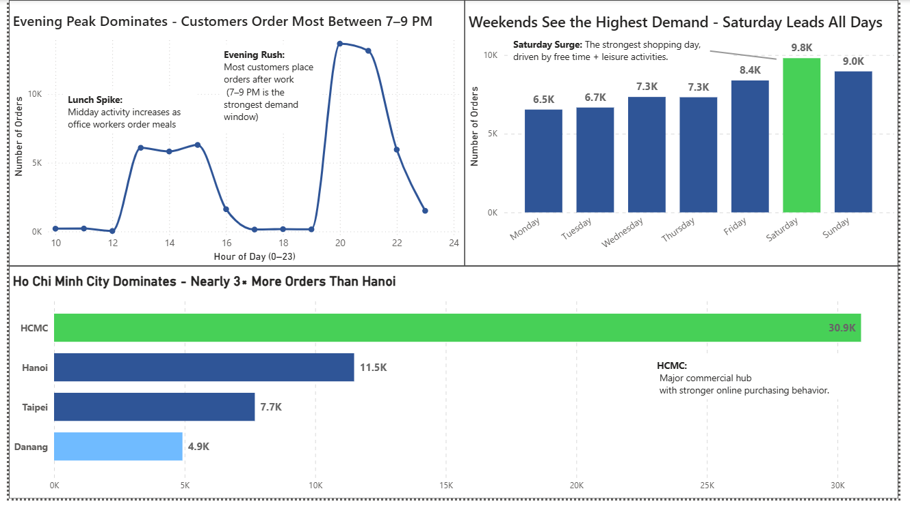
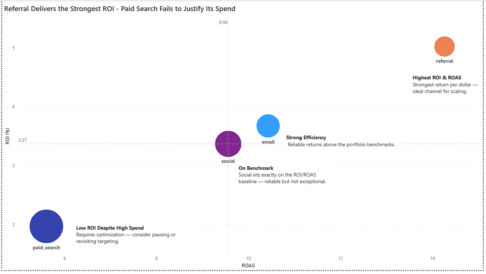
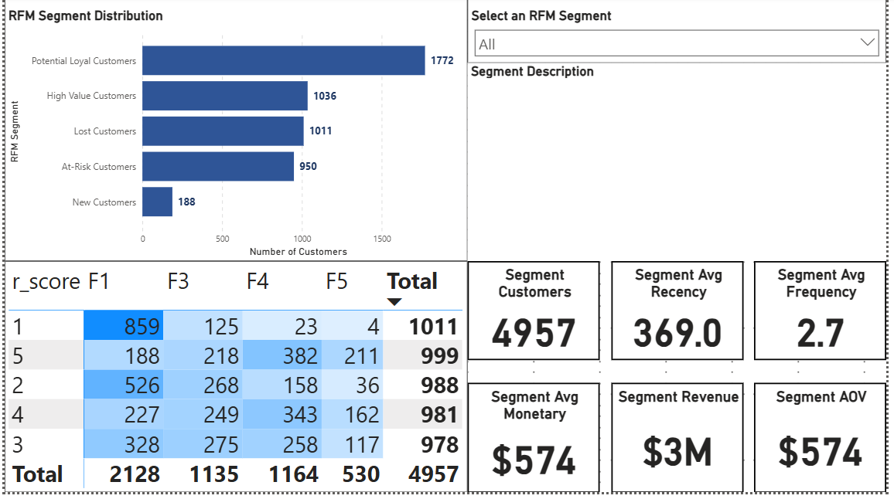
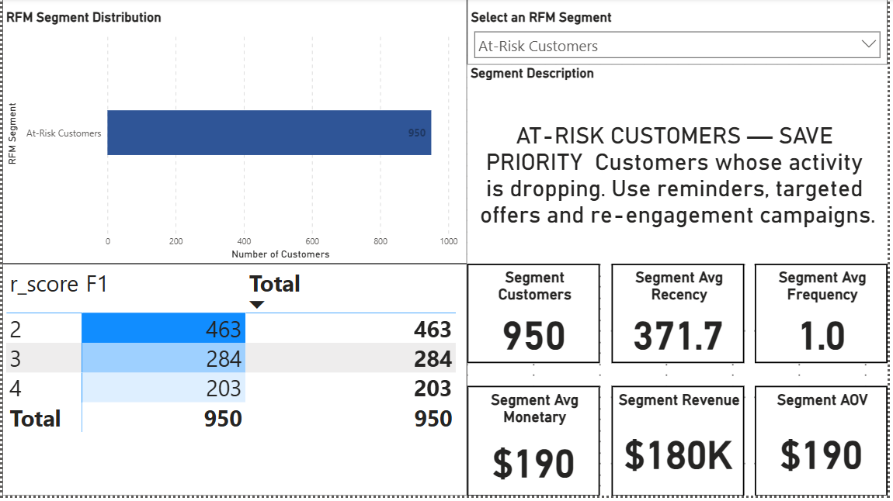

# ▶️ Explanatory video (https://www.loom.com/share/f64f0b609cc944af92d56ccfbf310e93)
# 📊 E-Commerce Customer Insights & Retention Dashboard

**End-to-End Analytics Project — SQL (BigQuery) • Power BI • RFM Segmentation • Marketing ROI**

This project simulates the analytics workflows used in a modern e-commerce company, turning raw transactional data into a complete **retention, customer behavior, and marketing efficiency dashboard**.

The goal is to help stakeholders understand:

- Revenue trends over time  
- Customer retention & repeat behavior  
- Geographic and hourly purchasing patterns  
- Marketing ROI & ROAS performance by channel  
- Customer segmentation (RFM) and data-driven actions  

---

## 🧠 Key Business Questions

This project answers **three strategic questions**, each supported by detailed analytical breakdowns:

### **1️⃣ How is the business performing over time?**
- How are revenue and orders trending across quarters?
- How is Average Order Value (AOV) evolving over time?

### **2️⃣ How are our customers behaving?**
- What does retention look like between new vs repeat customers?
- How do time of day, weekday, and geography influence purchasing behavior?
- What are our main RFM customer segments and what actions should we take for each?

### **3️⃣ Where should we invest our marketing budget for the highest return?**
- Which marketing channels deliver the strongest ROI and ROAS?

---

## 🛠️ Tech Stack

### **Data Engineering & SQL**

- Google BigQuery  
- SQL for cleaning, transforming, and building analytical layers  
- Star-schema modelling (Fact Orders + Dimensions)

### **Analytics & Visualization**

- Power BI  
- DAX for metrics, segmentation, and dynamic recommendations  

### **Customer Segmentation**

- RFM scoring (Recency, Frequency, Monetary)  
- Dynamic segment KPIs  
- Segment-level recommendations powered by DAX  

---

## 🗂️ Project Structure

```text
.
├── assets/
│   └── screenshots/
│       ├── page1_revenue_orders_quarter.png
│       ├── page2_aov_retention_repeat_vs_onetime.png
│       ├── page3_time_and_location.png
│       ├── page4_marketing_roi_roas.png
│       ├── page5_rfm_overview_all_segments.png
│       └── page5_rfm_segment_drilldown_at_risk.png
├── data/
│   └── ...  # cleaned / helper datasets
├── powerbi/
│   └── Ecommerce_RFM_Customer_Analytics.pbix
├── orders_realistic_FINAL.csv
└── README.md
```

(BigQuery SQL is managed directly in the warehouse; core transformation logic is described in the **Data Modelling** section.)

---

## 📈 Dashboard Overview

Below is a walkthrough of each dashboard page with screenshot previews.

---

## 📌 Page 1 — Revenue & Orders Over Time



**Insights delivered:**

- Total revenue by quarter  
- YOY seasonality patterns  
- High-level KPIs (Revenue, AOV, Orders)  

---

## 📌 Page 2 — AOV, Retention & Repeat Behavior



**Insights delivered:**

- AOV trend split by **new vs repeat customers**  
- Monthly **repeat-rate**  
- Clear customer lifetime behavior patterns  

---

## 📌 Page 3 — Time & Location Insights



**Insights delivered:**

- Orders per **hour** and **weekday**  
- Geographic breakdown by location  
- Identification of peak demand windows  

---

## 📌 Page 4 — Marketing Efficiency: ROI & ROAS



A bubble chart comparing:

- **ROI**  
- **ROAS**  
- **Marketing spend** (bubble size)

**Annotations highlight:**

- **Referral** — strongest ROI & ROAS  
- **Paid Search** — underperforming  
- **Email / Social** — strong mid-performers  

This visual makes it clear where to **scale, optimize, or cut spend**.

---

## 📌 Page 5 — RFM Segmentation & Strategic Actions

### 1️⃣ Segment Overview (All Customers)



Segments:

- Potential Loyal  
- High Value  
- At-Risk  
- Lost  
- New Customers  

### 2️⃣ Drilldown by Segment (Dynamic Recommendations)



Each segment shows:

- **Avg. Recency**  
- **Avg. Frequency**  
- **Avg. Monetary**  
- **Revenue**  
- **AOV**  
- Dynamic **strategy recommendation** (DAX-driven)  

---

## 🧮 Data Modelling

This project uses a clean and robust **star schema**.

### **Fact Table — Fact Orders**

Built from `raw.orders` (source: `orders_realistic_FINAL.csv`):

- `order_id`  
- `customer_id`  
- `order_date`  
- `channel`, `location`  
- Revenue, cost, profit fields  

### **Dimensions**

#### **Dim Customers**
Standardized customer data (IDs, channels, locations).

#### **Dim Customer RFM**
From `customer_rfm_segments_clean`:

- Recency (days since last order)  
- Frequency  
- Monetary  
- R/F/M scores (1–5)  
- Final segment group  

#### **Dim Channels**
Consistent marketing + orders channel mapping.

#### **Dim Locations**
Standardized city/region labels.

---

## 🔁 RFM Pipeline (BigQuery)

1. Compute **Recency, Frequency, Monetary**  
2. Assign **R/F/M scores**  
3. Map to final **segment groups**  
4. Load into Power BI as `Dim Customer RFM`  
5. Generate DAX-powered dynamic recommendations  

---

## 🎯 Key Quantitative Recommendations (Dynamic)

These insights update dynamically based on the selected segment:

- **At-Risk Customers** → Re-engage **~900** customers (avg recency **~370 days**)  
- **High Value Customers** → Protect **~1,000** loyal customers  
- **Lost Customers** → Win-back **~975** inactive users  
- **Potential Loyal** → Nurture **~1,768** customers nearing loyalty  

---

## 🚀 Final Notes

This project demonstrates:

- Full analytics lifecycle  
- BigQuery SQL + professional modelling  
- Clear, business-oriented Power BI storytelling  
- Strong marketing + retention analytics  
- Actionable, quantitative insights  

Structured to meet expectations of **Data Analyst** and **Business Analyst** roles.

---

## 🙎‍♂️ Contact

**Francesco Marchì**  
📧 marchi.frncsc@gmail.com  
🔗 https://www.linkedin.com/in/francesco-march%C3%AC-115657205/
